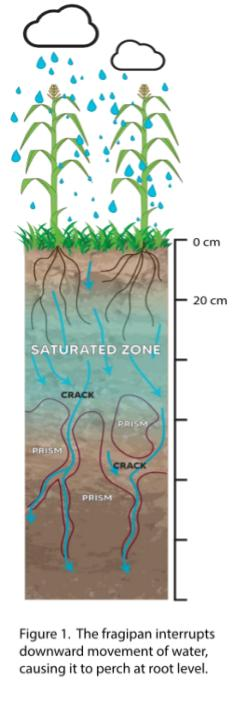
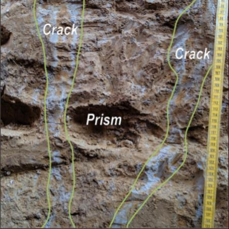

# critzone_fragipan_project_sites
## The Fragipan Project

The Critical Zone Pedology Lab at UKY began the Fragipan Project in 2019. The associated map displays site locations of where samples were collected.

Fragipans are a soil feature that restricts the downward movement of water and plant root penetration. They are extremely dense and contain brittle prisms with intermittent gaps between of coarse crack material that allow roots and water to enter.

Fragipans are common in aeolian soils of southeastern and midwestern US, especially western Kentucky because of its aeolian parent material (loess from 3 river systems in the area). Unfortunately these soil features can lead to plants with stunted roots that severely decreases crop yields. They also can result in a perched water table causing engineering problems preventing development of areas.

 Despite their existence being documented since late 1800s-early 1900s little is still known of what exactly causes fragipan formation nor how to break it down. The Critical Zone Pedology Lab is investigating a the properties of 8 pedons across 7 Kentucky counties containing fragipans in an effort to better understand:
 - characteristics of varying aged pedons
 - chemical, mineralogical and physical characteristics
 - discrete subunits of "crack" vs "prism" and their formation
 - the role of silica in bulk density and brittleness of the fragipan

